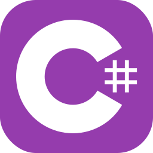

<h1 align="center">Roteiro de Estudos   <i><strong> Delegates em C#</strong></i></h1>

        
  <i>Ferramentas utilizadas</i>
   
    
    
    
    
    
    

 

## 🎯 Objetivo Principal

_Ver se esse tal de delegate entra de vez na minha cabecinha_ 🥵 

## :memo: Metododologia

_Resolver uma lista de exercícios desenvolvida pelo meu querido [ChatGPT](https://chatgpt.com/)_ (e torcer pra não ser humilhada quando encaminhar a solução)

## :pencil2:Exercícios Propostos

### :computer: **Nível 1 — Entender o básico**

👉 Objetivo: aprender a **declarar** um delegate e usá-lo com um método.

1. Crie um delegate que recebe uma `string` e retorna `void`.
2. Associe o delegate a um método que imprime a mensagem no console.
3. Teste chamando o delegate com várias strings.

💡 Exemplo de desafio:

* Delegate: `delegate void Mensagem(string texto);`
* Método: `static void Exibir(string msg)` → imprime no console.

 

### :computer: **Nível 2 — Multicast Delegate**

👉 Objetivo: usar **mais de um método** no mesmo delegate.

1. Crie dois métodos: `Ola(string nome)` e `Tchau(string nome)`.
2. Associe os dois ao mesmo delegate (`+=`).
3. Teste chamando o delegate e veja que os dois métodos são executados.

💡 Desafio extra:

* Crie um delegate que chama três métodos diferentes (um escreve em maiúsculo, outro em minúsculo, outro normal).

 

### :computer:  **Nível 3 — Delegates como parâmetros**

👉 Objetivo: aprender a passar funções como argumento.

1. Crie um delegate `delegate int Operacao(int a, int b);`
2. Implemente dois métodos: `Somar` e `Subtrair`.
3. Crie um método `Executar(int x, int y, Operacao op)` que chama o delegate.
4. Teste chamando `Executar(5,3,Somar)` e `Executar(5,3,Subtrair)`.

💡 Desafio extra:

* Crie também `Multiplicar` e `Dividir`, e passe para o mesmo `Executar`.

 

### :computer:  **Nível 4 — Delegates genéricos e Func/Action**

👉 Objetivo: perceber que existem **atalhos prontos** no .NET.

1. Substitua `delegate int Operacao(int a, int b);` por `Func<int,int,int>`.

   * `Func<entrada1, entrada2, retorno>`
2. Teste com `Func<int,int,int> op = Somar;`
3. Para métodos que não retornam nada, use `Action<T>`.

💡 Desafio extra:

* Crie um `Action<string>` que recebe uma string e imprime em maiúsculo.

 

### :computer:  **Nível 5 — Eventos (baseados em delegates)**

👉 Objetivo: ver como delegates são a base dos eventos.

1. Crie um delegate `delegate void Notificacao(string msg);`
2. Crie uma classe `Alarme` que tem um evento `public event Notificacao AoDisparar;`
3. No método `Disparar()`, chame `AoDisparar?.Invoke("Acorda Dalila!!");`
4. No `Main`, associe dois métodos diferentes ao evento (`+=`) e teste.

💡 Desafio extra:

* Crie um evento para "Processo Finalizado" em uma classe `Processador`.

 

### :computer:  **Nível 6 — Lambda Expressions com delegates**

👉 Objetivo: simplificar o uso.

1. Use `Func<int,int,int> op = (a,b) => a + b;`
2. Teste com vários cálculos diferentes, tudo em lambdas.
3. Compare com métodos normais.

💡 Desafio extra:

* Crie uma lista de inteiros e use `List<int>.ForEach(x => Console.WriteLine(x * 2));`

